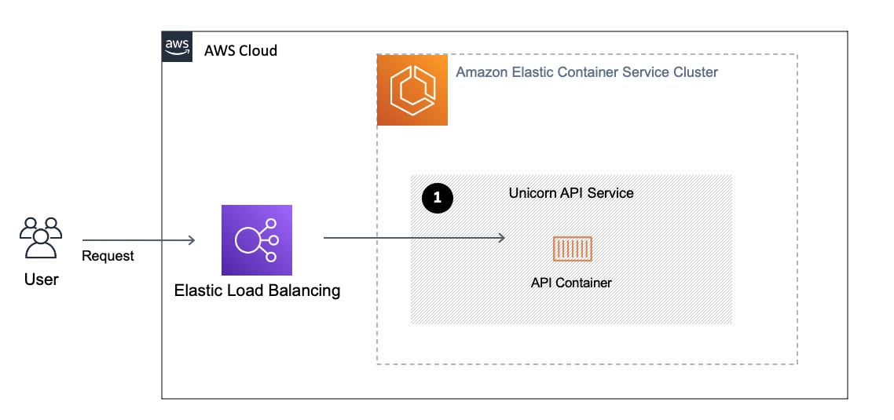

# Debugging Docker Containers running on Amazon ECS

This project will show you how to debug Docker containers running on Amazon ECS using the AWS Toolkit in PyCharm. This will also work with other IDEs from JetBrains such as IntelliJ, WebStorm etc. 
 
## Goal

We want to debug our RESTful API (based on Flask) which is running in a container on ECS with our local IDE.

## Setup

This project is an AWS CDK application which is an open source software development framework to define cloud application resources using familiar programming languages. For more information check out the [AWS CDK Website](https://aws.amazon.com/cdk/). 
The deployed architecture looks like this:


To deploy the application to your AWS account complete the following steps:

- Clone repository to your dev environment
```bash
$ git clone https://github.com/aws-samples/cloud-debugging-with-aws-toolkit.git
```
- Change to the cloned directory
- Create virtual environment for Python 3
```bash
$ python3 -m venv .venv
```
- Activate virtual environment
```bash
$ source .venv/bin/activate
```
If you are on Windows use the following command to activate your environment:
```bash
% .venv\Scripts\activate.bat
```
- Install requirements for the CDK application
```bash
$ pip install -r requirements.txt
```
- Deploy Infrastructure to your AWS account. Make sure AWS Credentials are configured, before running the next command. Instructions to setup your AWS credentials can be found in the [AWS Documentation](https://docs.aws.amazon.com/cli/latest/userguide/cli-configure-files.html).
```bash
$ cdk bootstrap && cdk deploy
```
When the CloudFormation Stack completes our RESTful API is deployed to Amazon ECS. The next step is to setup PyCharm.

## PyCharm Setup

- [Install AWS Toolkit for JetBrains](https://docs.aws.amazon.com/toolkit-for-jetbrains/latest/userguide/key-tasks.html#key-tasks-install)
- Enable Cloud Debug
  - Ensure a profile for your AWS Credentials is configured. How to create a profile for the AWS CLI is described in the [AWS Documentation](https://docs.aws.amazon.com/cli/latest/userguide/cli-configure-files.html). 
  - If your user or role specified in the profile does not have Administrator access, attach a customer managed IAM policy named **unicorn-api-userPolicy** which was created during the deployment.
  - Open AWS Explorer in PyCharm, select the previously created AWS profile and the desired AWS region
  - Select **Amazon ECS**
  - Select **Clusters** 
  - Select your cluster (should be named **unicorn-api-uncorn**)
  - Right click on the service and enable **Cloud Debugging (Beta)**
  - Select the role where the name start with **unicorn-api-unicornServiceTaskDefTaskrole-** This is the standard ECS Task Role with the AmazonSSMManagedInstanceCore Policy attached.
  - (Optional) This might take a few minutes, to speed things up navigate to the AWS Console in your browser and stop the unicorn Task manually.
  - The Build section in PyCharm will show that the setup completed
- Setup Debug Configuration
  - Click on **Run** > **Edit Debug Configurations**
  - Select The **AWS ECS Service Cloud Debug (Beta)** Configuration
  - On the right side select your Unicorn API Cluster and Service
  - Select Platform: **PYTHON**
  - Enter StartComamnd: **python src/app.py**
  - Map Artifacts: Select your local src folder which contains **app.py** Set remote Path to: .
- Start Debugging
  - Right click on your Unicorn ECS Service in the AWS Explorer and click **Debug**
  - This will sync your local Code to the container. To resync the code you must restart the debugger (not the cloud debug setup). For setting breakpoints no reload is needed.
  - Use PyCharm Debugging tools (Console, Inspect variables,...)
- Start a remote shell
  - Right click on your Unicorn ECS Service in the AWS Explorer and select **Container** > **Web** > **Start Remote Shell**
  - Run the following command to install and run htop, to examine running processes in your container.
```bash
$ apt-get update && apt-get install htop && htop
```
## Disable Cloud Debug and remove AWS resources
- Click on your **cloud-debug-unicorn** ECS Service in the AWS Explorer and click **Disable CloudDebuggin**
- To delete the AWS resources run the following command:
```bash
$ cdk destroy
```
- If needed delete any remaining resources manually